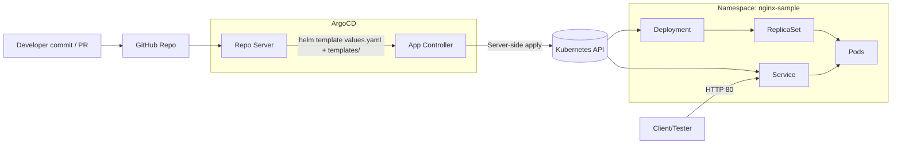
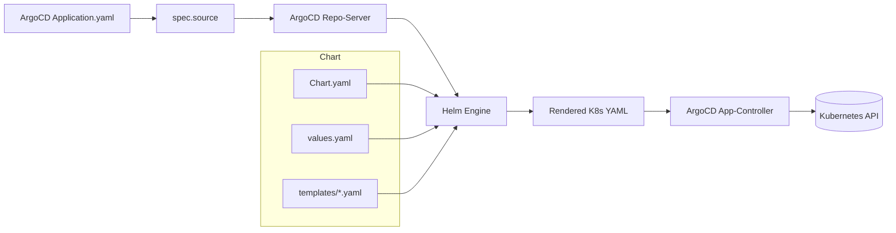

# 🧭 NGINX Sample — Architecture & End-to-End Flow

This doc explains **what reads what**, **who applies what**, and **how the files link up** from Git → ArgoCD → Helm → Kubernetes.

---

## 1) Who’s the “master”?

- **Single source of truth = your Git repository.**
- The **ArgoCD Application** (CRD) only *points* to the repo path/branch and defines where to deploy + how to sync.
- **Helm** renders `templates/*.yaml` using `values.yaml` into pure Kubernetes manifests.
- ArgoCD compares desired (from Git) vs live (cluster) and **reconciles** (self-heal + prune).

---

## 2) High-level architecture

### Flow A: Git to Cluster Deployment

**Explanation**:  
- Repo Server fetches the source and renders Helm templates.  
- App Controller compares desired vs live state, applies changes, and self-heals.  
- Kubernetes API creates Deployments, ReplicaSets, Pods, and Services.  

### Flow B: Helm Chart Processing

**Explanation**:  
- `Chart.yaml` defines chart metadata.  
- `values.yaml` provides defaults (replicas, image, service).  
- `templates/*.yaml` are Go templates rendered with values.  
- Helm outputs Kubernetes manifests which ArgoCD applies via the App Controller.  

---
## Key Takeaways
- Git is always the single source of truth.  
- ArgoCD continuously reconciles desired vs live state.  
- Helm enables flexible configuration via `values.yaml` and templates.  
- The system is self-healing and prunes drift automatically.  