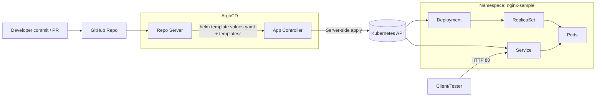
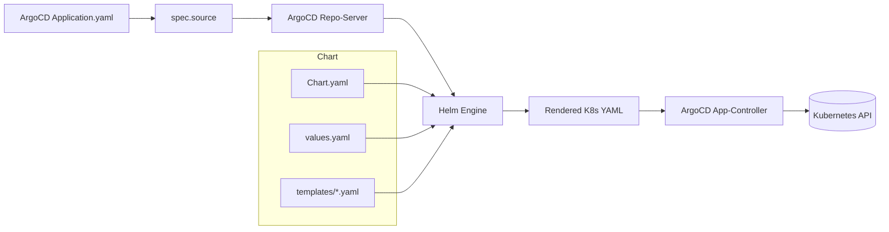

---

## 🚀 What is ArgoCD?

ArgoCD is a **declarative GitOps continuous delivery tool** for Kubernetes. It watches a Git repository for changes and ensures the cluster state always matches the Git state.

- **Git = single source of truth**
- **ArgoCD = reconciler** (keeps cluster in sync with Git)
- **Kubernetes = execution environment**

📖 For installation steps, see [ArgoCD Setup Guide](./argo-cd-setup.md) (separate README).

---

## 🔑 Before Deploying Any Application

Before creating an application in ArgoCD, you need to:

1. **Create a Project** in ArgoCD (projects group multiple apps and control permissions).

2. **Connect your Git Repository** in the ArgoCD UI/CLI (so ArgoCD can fetch manifests or Helm charts).

3. **Prepare your Helm chart** (folder structure with `Chart.yaml`, `values.yaml`, `templates/`).

4. **Define an Application CRD** (`application.yaml`) that points to your Git repo + chart path.

---

## ⚙️ How ArgoCD Deploys an Application Using Helm

1. **ArgoCD Application (CRD)** → tells ArgoCD which repo, path, and branch to watch.

2. **Repo Server** → fetches the chart and runs Helm template rendering.

3. **Helm Engine** → combines `Chart.yaml`, `values.yaml`, and `templates/` into Kubernetes YAML.

4. **Application Controller** → compares desired vs live cluster state and applies changes.

5. **Kubernetes API** → creates Deployments, Services, and other resources.

---

## 🧭 NGINX Sample — Architecture & End-to-End Flow

This doc explains **what reads what**, **who applies what**, and **how the files link up** from Git → ArgoCD → Helm → Kubernetes.

---

### 1) Who’s the “master”?

- **Single source of truth = your Git repository.**

- The **ArgoCD Application** (CRD) only *points* to the repo path/branch and defines where to deploy + how to sync.

- **Helm** renders `templates/*.yaml` using `values.yaml` into pure Kubernetes manifests.

- ArgoCD compares desired (from Git) vs live (cluster) and **reconciles** (self-heal + prune).

---

### 2) High-level architecture

#### Flow A: Git to Cluster Deployment



**Explanation:**  
- Repo Server fetches the source and renders Helm templates.  
- App Controller compares desired vs live state, applies changes, and self-heals.  
- Kubernetes API creates Deployments, ReplicaSets, Pods, and Services.  

#### Flow B: Helm Chart Processing



**Explanation:**  
- `Chart.yaml` defines chart metadata.  
- `values.yaml` provides defaults (replicas, image, service).  
- `templates/*.yaml` are Go templates rendered with values.  
- Helm outputs Kubernetes manifests which ArgoCD applies via the App Controller.  

---

## Key Takeaways

- Git is always the single source of truth.  

- ArgoCD continuously reconciles desired vs live state.  

- Helm enables flexible configuration via `values.yaml` and templates.  

- The system is self-healing and prunes drift automatically.  

---

## 📂 NGINX Sample — File & Folder Structure

```plaintext
nginx-sample/
├── Chart.yaml            # metadata about the chart
├── values.yaml           # default values (replicaCount, image, service)
├── templates/            # k8s manifests as Go templates
│   ├── deployment.yaml
│   ├── service.yaml
│   └── _helpers.tpl
└── application.yaml      # ArgoCD Application CRD pointing to repo/chart
```

### How Each File Interacts

- **Chart.yaml**  
  - Metadata of the chart (name, version, description). ArgoCD/Helm reads this first.  

- **values.yaml**  
  - Default input values (replicas, image, service type). These feed into the templates.  

- **templates/deployment.yaml**  
  - Creates a Deployment using values (like `.Values.replicaCount`).  

- **templates/service.yaml**  
  - Creates a Service using values (like `.Values.service.type`).  

- **templates/_helpers.tpl**  
  - Defines helper functions/macros to avoid duplication.  

- **application.yaml**  
  - ArgoCD CRD that points to this chart, repo, and namespace. This file “connects” Git + Helm + Kubernetes.

### Flow Recap

1. `application.yaml` tells ArgoCD where to pull the chart.  

2. Helm processes `Chart.yaml`, `values.yaml`, and `templates/`.  

3. Rendered Kubernetes YAML → ArgoCD applies via Kubernetes API.  

4. Cluster spins up Deployments (Pods) and Services.  

---